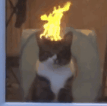
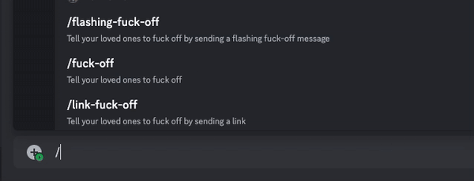
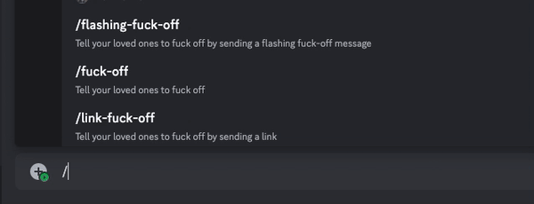
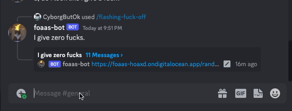

<br>

# Discord Bot for Fuck-Off-As-A-Service
This is a bot to generate random fuck-off messages to your server. [Invite](https://discord.com/api/oauth2/authorize?client_id=1104850607556272138&permissions=2048&scope=applications.commands%20bot) this angry cat to your server!

```txt
!!You shall not use this bot to harass or bully anyone!!
```

I developed this bot to play with my boyfriend. I leave it here because it does not gain any popularity anyway. If this bot somehow is being used to bully or harass anyone, please lmk and I will shut it down immediately.

## Usages
### `/flashing-fuck-off` Command to Send Flashing Random Fuck-off Messages

### `/link-fuck-off` Command to Send a Random Fuck-off Message as an embedded link preview

### `/fuck-off` Command to Send a Random Text Fuck-off Message


## Credits
This bot is using the public API [Fuck-off-as-a-service](https://foaas-hoaxd.ondigitalocean.app/), of which the GitHub repo is [here](https://github.com/SiyaoIsHiding/foaas), which is based on the original [Fuck-off-as-a-service](https://foaas.com/), with an additional random message generation feature.